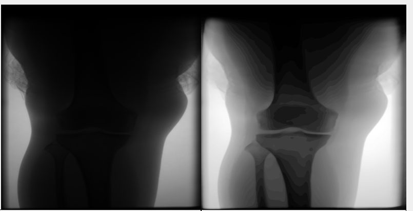

# SEU-Digital-Image-Labwork

东南大学计算机科学与技术数字图像处理实验 Digital Image Process Labwork


## Introduction

### 平台框架

- `QT - 5.15`
-  `OpenCV -4.5.2`
-   `MinGW`

#### OpenCV-4.5.2 配置

<a href = "Opencv-4.5.2">OpenCV免配置

QT 项目.pro文件添加Opencv 代码 
```py
INCLUDEPATH += D:/QT/OpenCV-MinGW-Build-OpenCV-4.5.2-x64/include
               D:/QT/OpenCV-MinGW-Build-OpenCV-4.5.2-x64/include/opencv2

LIBS +=  D:/QT/OpenCV-MinGW-Build-OpenCV-4.5.2-x64/x64/mingw/lib/lib*.a

```

### 实验内容

#### 实验1 滤波与噪声
- ✅ 加入高斯噪声
- ✅ 加入椒盐噪声
- ✅ 中值处理
- ✅ 均值处理
- ✅ 自适应中值处理
- ✅ Nonlocal  means
 
<a href = "Lab1/"> Lab1

#### 实验2 图像锐化
- ✅ 基于二阶导数（拉普拉斯算子）图像增强
- ✅ 非锐化掩蔽(Unsharp Masking)

<a href = "Lab2/"> Lab2

#### 实验3 图像压缩
- ✅ JPEG压缩
- ✅ JPEG2000压缩

<a href = "Lab3/"> Lab3

#### 实验4 形态学实验
- ✅ 对指纹图片进行形态学滤波
- ✅ 对于图像的断裂处，恢复
 
<a href = "Lab4/"> Lab4

#### 实验5 图像分割
- ✅ 全局阈值
- ✅ OTSU阈值法

<a href = "Lab5/"> Lab5

#### 实验6 边缘检测
- ✅ Canny算子检测边界
- ✅ Sobel算子检测

<a href = "Lab6/"> Lab6

#### 实验7 聚类算法实现图像压缩
- ✅ K-Means
- ✅ DBSCAN
- ✅ AGENS

<a href = "Lab7/"> Lab7


#### 实验8 聚类算法实现图像压缩
- ✅ K-Means
- ✅ DBSCAN
- ✅ AGENS

<a href = "Lab8/"> Lab8

#### 实验9 医学图像处理

<a href = "Lab9/"> Lab9

### 实验报告

参见 `doc` 文件夹


### 展示

